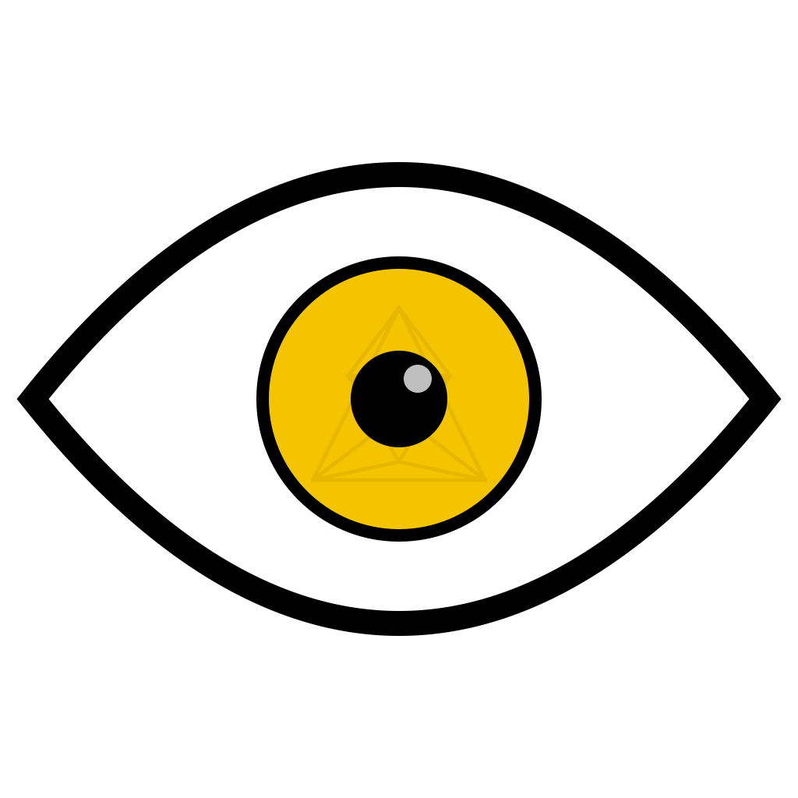
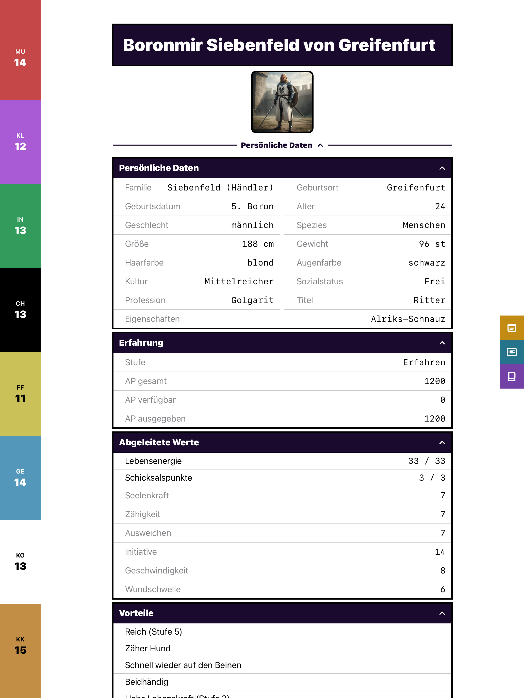
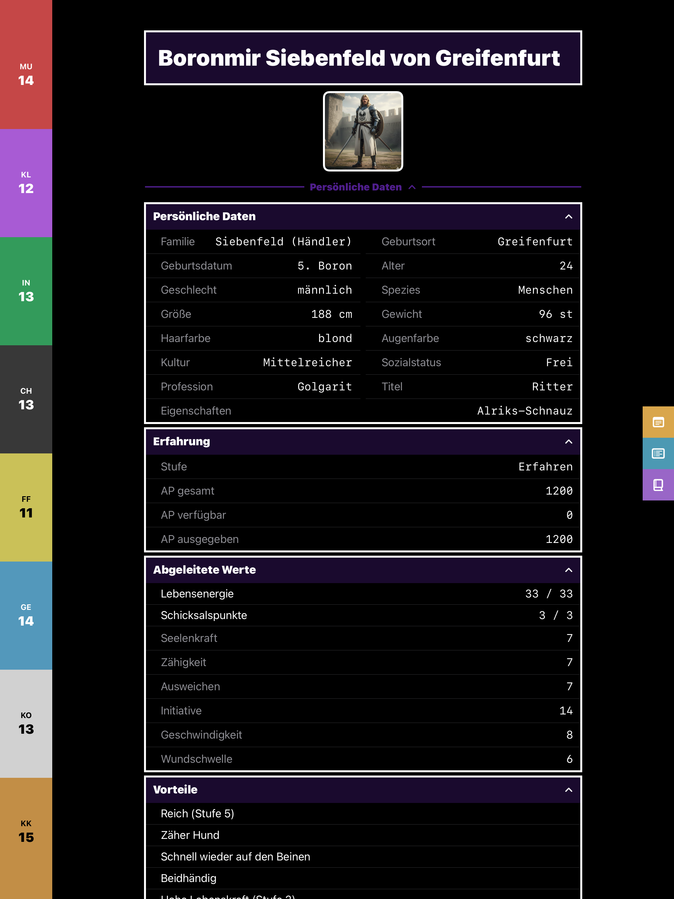
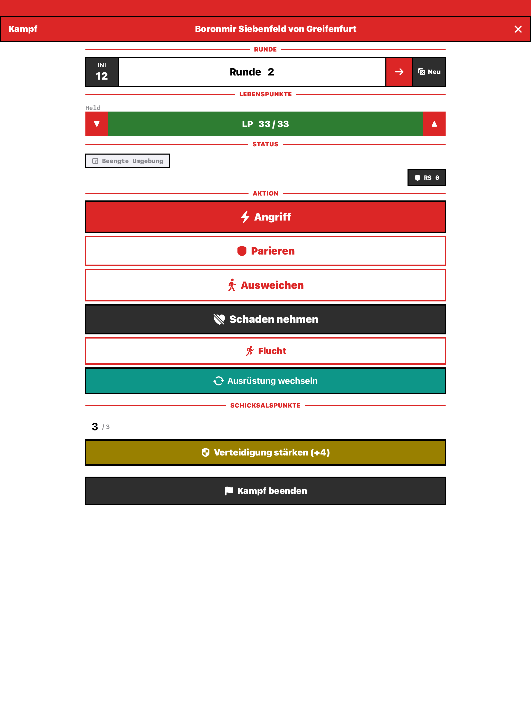
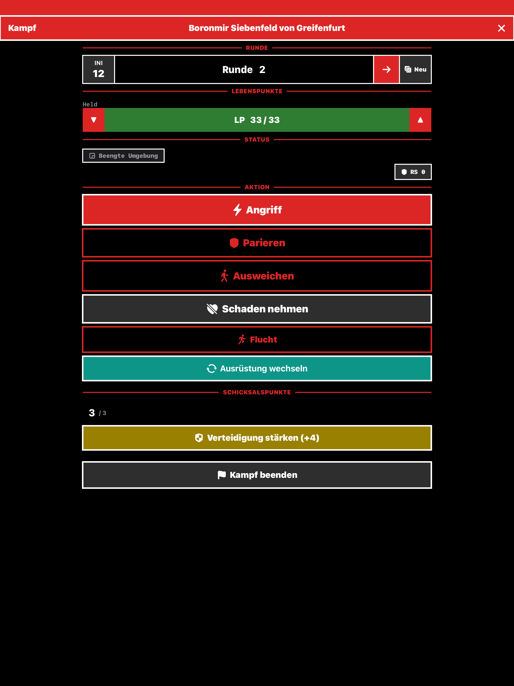
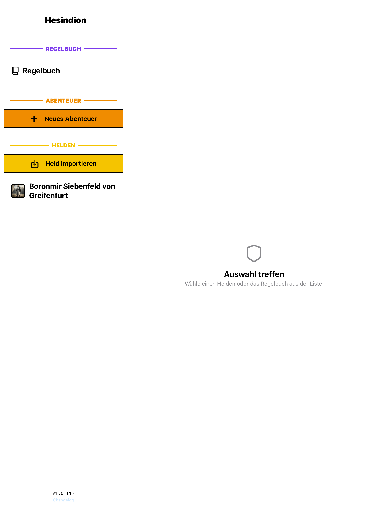
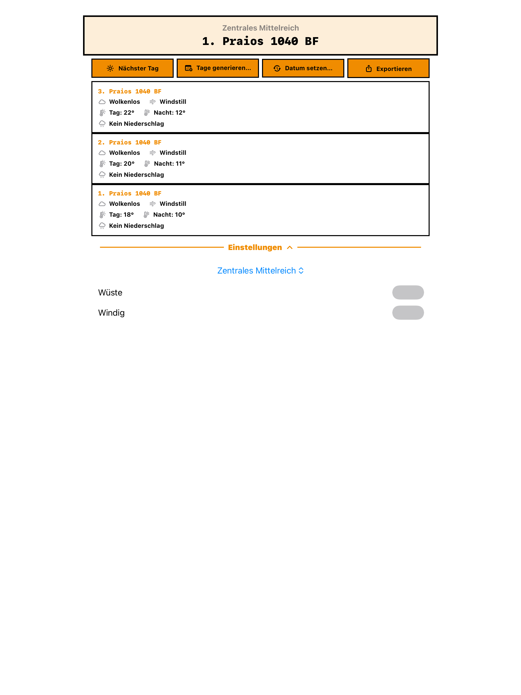

# Hesindion

<p align="center">
  
</p>

**Hesindion** is an iOS/iPadOS companion app for [Das Schwarze Auge](https://ulisses-spiele.de/spielsysteme/das-schwarze-auge/) (The Dark Eye) 5th Edition tabletop RPG sessions. Named after Hesinde, the Aventurian goddess of wisdom and knowledge.

Import your heroes from [Optolith](https://optolith.app), roll dice, run full combat encounters, track adventures with weather, and look up rules — all from your iPad or iPhone.

## Screenshots

<p align="center">
  
  &nbsp;&nbsp;
  
</p>
<p align="center"><em>Character sheet with attributes, personal data, advantages, and equipment — light and dark mode</em></p>

<p align="center">
  
  &nbsp;&nbsp;
  
</p>
<p align="center"><em>Combat dashboard with initiative, LP tracking, actions, and Schicksalspunkte</em></p>

<p align="center">
  
  &nbsp;&nbsp;
  
</p>
<p align="center"><em>Hero list with Regelbuch and adventures — Adventure view with Aventurian calendar and weather generation</em></p>

## Features

### Hero Management
- Import heroes directly from Optolith JSON exports
- Full character sheet: attributes, derived values, advantages, disadvantages, special abilities
- Per-profession color schemes (19 palettes including priests by deity, warriors, mages)
- LP (Lebenspunkte) tracking with healing and rest commands

### Combat System
- Step-by-step combat flow: armor selection, initiative, loadout, then combat rounds
- Melee attacks with maneuvers (Finte, Wuchtschlag, Vorstoß, Schildspalter, Sturmangriff)
- Ranged combat (Fernkampf) with full modifier support (distance, size, movement, visibility)
- Defense: Parieren and Ausweichen with automatic modifier calculation
- Weapon reach, dual-wielding, two-handed grip, shield combat
- Mounted combat (Reiterkampf) with Niederreiten and Sturmangriff zu Pferd
- Patzertabellen (fumble tables) as alternative to SP damage
- Schicksalspunkte integration (reroll, damage reroll, defense boost, ignore condition)
- Schmerz (pain) tracking with automatic penalty application
- Combat session persistence — exit and resume without losing state

### Dice Rolling
- General-purpose dice roller with configurable count and sides
- 3W20 talent/skill checks with modifier breakdown and quality level (QS) calculation
- Tumble animation on rolls

### Adventures & Weather
- Aventurian calendar (12 months + Namenlose Tage)
- Weather generation for 13 climate regions with day/night temperatures, wind, cloud cover, and precipitation

### Rulebook
- Integrated rules database for spells, liturgies, talents, and combat techniques
- Detail views with full rule descriptions

### Action Log (Protokoll)
- Event-sourced log of all actions (talent checks, combat, healing, resting)
- Combat entries grouped by session with collapsible headers
- Swipe-to-delete with automatic state reversal
- Split-screen layout with Notes and Regelwerk panels

### Layout
- `NavigationSplitView` for iPad two-pane layout
- Landscape split-screen panels (Notes, Protokoll, Regelwerk) at 50/50
- Portrait full-screen overlays
- Adaptive content width for iPad (proportional margins, max-width cap)
- Command palette (Cmd+K) for quick actions

## Design

The UI follows a **Neo-Brutalist** design theme — bold borders, high-contrast surfaces, strong typography, and flat colors. Each profession gets its own color scheme for visual identity.

## Requirements

- iOS 26.0+
- iPhone or iPad
- No external dependencies — built entirely with Apple frameworks (SwiftUI, SwiftData)

## Build & Run

Open `Hesindion.xcodeproj` in Xcode, or use the Makefile:

```bash
make run          # Build and launch on iPhone simulator
make run-ipad     # Build and launch on iPad simulator
make deploy       # Build and deploy to physical device
make clean        # Clean build artifacts
```

## Architecture

- **SwiftUI** for all UI
- **SwiftData** with `@Model` macro for persistence and schema migrations
- `@Query` for reactive data fetching, `@Environment(\.modelContext)` for mutations
- Combat orchestrated via `CombatView` with a `CombatStep` enum driving navigation
- Modifier calculations centralized in `ModifierEngine`
- Hero import via `OptolithImportService`

## Project Structure

```
Hesindion/
├── HesindionApp.swift          # App entry point, ModelContainer setup
├── Models/                     # SwiftData @Model classes (Hero, Weapon, Armor, ...)
├── Views/                      # SwiftUI views (HeroDetail, Combat, Adventure, ...)
├── Engine/                     # Combat & skill calculation engines
├── Services/                   # Import, rules database, weather generation
├── Theme/                      # Color schemes, layout constants, animations
├── Migration/                  # SwiftData schema versioning
└── Resources/                  # Static rule data, changelog
```

## Documentation

- `AGENTS.md` — Agent instructions for AI-assisted development
- `CHANGELOG.md` — All notable changes ([Keep a Changelog](https://keepachangelog.com))
- `docs/adr/` — Architecture Decision Records
- `docs/plans/` — Implementation plans and design documents

## License

Private project. All rights reserved.
